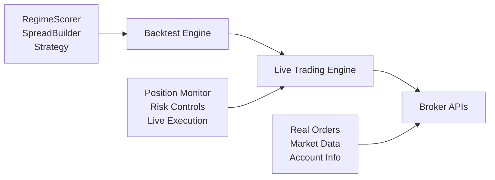

# 🚀 0DTE Live Trading System

> **A comprehensive live trading system that brings backtested ODTE (Zero Days to Expiry) options strategies to real-world trading with multiple broker integrations.**

---

## 🚨 **CRITICAL DISCLAIMERS**

### ⚠️ **DEFENSIVE TRADING ONLY** ⚠️

| ⚡ **WARNING** | **DESCRIPTION** |
|:---:|:---|
| 📚 | This system is designed for **EDUCATIONAL and RESEARCH purposes** |
| 💸 | All trading involves **SUBSTANTIAL RISK of loss** |
| 📝 | Start with **PAPER TRADING only** |
| 👤 | You are **RESPONSIBLE for all trading decisions** |
| 📉 | Past performance does **NOT guarantee future results** |
| 🔥 | Options trading can result in **TOTAL LOSS of investment** |

---

## 🏗️ **Architecture Overview**

The live trading system extends the backtesting engine with real broker integrations:



---

## 🔧 **System Components**

### **1. Broker Interfaces** (`ODTE.LiveTrading`)

| Component | Description |
|:---|:---|
| `IBroker` | Universal broker interface |
| `IBKRMockBroker` | Interactive Brokers simulation |
| `RobinhoodMockBroker` | Robinhood simulation |
| `LiveTradingEngine` | Core orchestrator |

### **2. Console Application** (`ODTE.LiveTrading.Console`)

- 📊 Interactive dashboard
- 🔄 Real-time monitoring
- ⌨️ Command-line controls
- 🛑 Emergency stop functionality

---

## 🚀 **Quick Start Guide**

### **Step 1: Build the Projects**
```bash
cd C:\code\ODTE
dotnet build
```

### **Step 2: Run Live Trading Console**
```bash
cd ODTE.LiveTrading.Console
dotnet run
```

### **Step 3: Interactive Setup**

1. **Select Broker** → Choose IBKR or Robinhood (mock)
2. **Enter Credentials** → Username/API keys (simulated)
3. **Paper Trading** → Always recommended for testing
4. **Start Engine** → Begin live strategy execution

---

## 🛡️ **Safety Features**

### **🔒 Multiple Circuit Breakers**

| Feature | Description |
|:---|:---|
| **Daily Loss Limits** | Automatic shutdown at configured loss |
| **Position Limits** | Maximum concurrent positions enforced |
| **Delta Breach Detection** | Exit when Greeks exceed limits |
| **Emergency Stop** | Immediate closure of all positions |
| **Economic Event Blocking** | No trading during major announcements |

### **📊 Risk Management**

- ✅ **Pre-trade Validation** - All orders validated before submission
- 📡 **Real-time Monitoring** - Continuous position surveillance
- 💰 **Account Equity Checks** - Ensure sufficient margin
- 🔌 **Broker Connection Monitoring** - Pause on disconnect

### **📝 Audit & Compliance**

- 📋 **Complete Decision Log** - All strategy decisions recorded
- 🔍 **Order Audit Trail** - Full order lifecycle tracking
- ⚠️ **Error Logging** - Comprehensive error reporting
- 🏛️ **Regulatory Compliance** - Designed for audit requirements

---

## 📊 **Dashboard Commands**

### **⚙️ Engine Control**

| Command | Description |
|:---|:---|
| `start` | Start the trading engine (requires confirmation) |
| `stop` | Stop trading (graceful shutdown) |
| `pause` | Pause new positions (monitor existing) |
| `resume` | Resume trading from pause |
| `estop` | Emergency stop (immediate closure) |

### **📈 Monitoring**

| Command | Description |
|:---|:---|
| `status` | Detailed account and market status |
| `positions` | View all active positions |
| `orders` | Show recent order history |
| `config` | Display current configuration |

### **🔧 Utilities**

| Command | Description |
|:---|:---|
| `help` | Show help information |
| `exit` | Exit the application |

---

## 🔌 **Broker Implementations**

### **Interactive Brokers (Mock)**

#### **Features Simulated:**
- ✅ TWS/Gateway connection
- ✅ Real-time option chains
- ✅ Portfolio margin calculations
- ✅ Complex spread orders
- ✅ Risk monitoring

#### **IBKR-Specific Features:**
- Options approval levels (0-5)
- Pattern Day Trader rules
- European market hours
- Professional fee structure

### **Robinhood (Mock)**

#### **Features Simulated:**
- ✅ OAuth authentication
- ✅ Commission-free trading
- ✅ Pattern Day Trader restrictions
- ✅ Limited option expirations
- ✅ Social trading features

#### **Robinhood-Specific Features:**
- Gold membership benefits
- Mobile-first interface
- Crypto integration
- Push notifications
- Simplified options chains

---

## 📈 **Strategy Implementation**

### **🎯 Market Regime Analysis**

| Strategy | Description |
|:---|:---|
| **Opening Range Breakouts** | First 15-minute range analysis |
| **VWAP Persistence** | Trend confirmation via volume-weighted price |
| **Volatility Regimes** | ATR-based volatility classification |
| **Economic Calendar** | Event-driven risk management |

### **📊 Position Types**

| Type | Market Condition | Strategy |
|:---|:---|:---|
| **Iron Condors** | Range-bound | Sell volatility |
| **Put Credit Spreads** | Bullish | Directional income |
| **Call Credit Spreads** | Bearish | Directional income |
| **Risk-Defined** | All | Maximum loss limits |

### **🚪 Exit Management**

- **Credit Multiple Stops** → Exit at 2x credit loss
- **Delta Breach** → Close when delta exceeds 30%
- **Time Decay** → Auto-close approaching expiry
- **Economic Events** → Force closure before announcements

---

## ⚙️ **Configuration Example**

### **Live Trading Optimizations**

```csharp
var config = new SimConfig
{
    Underlying = "SPY",                    // High liquidity
    CadenceSeconds = 300,                  // 5-minute decisions
    NoNewRiskMinutesToClose = 30,          // Stop 30 min before close
    
    Risk = new RiskCfg
    {
        DailyLossStop = 200,               // Conservative $200 limit
        PerTradeMaxLossCap = 50,           // $50 per trade max
        MaxConcurrentPerSide = 1           // Very conservative
    },
    
    Stops = new StopsCfg
    {
        CreditMultiple = 2.0,              // Tighter stops for live
        DeltaBreach = 0.30                 // 30% delta threshold
    }
};
```

---

## 🔄 **Production Upgrade Path**

### **1. Real Broker Integration**

#### **IBKR Implementation**
```bash
# Steps for production IBKR integration
1. Install Interactive Brokers TWS/Gateway
2. Use official IBApi NuGet package
3. Handle real authentication and 2FA
4. Implement connection management
```

#### **Robinhood Implementation**
```bash
# Steps for Robinhood integration
1. OAuth 2.0 token management
2. Rate limiting compliance
3. 2FA authentication
4. Monitor for API changes
```

### **2. Data Feeds**

| Feed Type | Providers |
|:---|:---|
| **Options Chains** | ORATS, LiveVol, dxFeed |
| **Market Data** | Bloomberg, Refinitiv |
| **Economic Calendar** | Fred API |
| **Volatility Data** | CBOE feeds |

### **3. Infrastructure**

- 💾 **Database** → Persistence layer
- 📨 **Message Queue** → RabbitMQ/Kafka
- 📊 **Monitoring** → Prometheus/Grafana
- 🔔 **Alerting** → PagerDuty/Slack

---

## 🏃‍♀️ **Running the System**

### **Development Mode**

```bash
# Build all projects
dotnet build

# Run console application
cd ODTE.LiveTrading.Console
dotnet run
```

### **Example Session**

```
════════════════════════════════════════
      0DTE Live Trading Engine
    Defensive Options Trading System
════════════════════════════════════════

📊 Select your broker:
1. Interactive Brokers (IBKR UK) - Mock
2. Robinhood - Mock
3. Exit

Enter your choice (1-3): 1

🏦 Setting up Interactive Brokers connection...

Username: testuser
API Key: test123
Use Paper Trading? (Y/n): Y

🔗 Connecting to IBKR TWS...
✅ Connected to IBKR successfully!
📋 Account: DU1234567
💰 Net Liquidation Value: $100,000.00
💵 Available Funds: $80,000.00
🎯 Options Level: 5

════════════════════════════════════════
       📊 LIVE TRADING DASHBOARD
════════════════════════════════════════

🎯 Engine Status: STOPPED
💰 Account Value: $100,000.00
💵 Available Funds: $80,000.00
📈 Total P&L: $0.00
📋 Active Positions: 0
⏳ Pending Orders: 0
📊 Decisions Made: 0
📤 Orders Submitted: 0
🔗 Broker: Connected

Enter command: start
🚀 Starting trading engine...
⚠️  Confirm start trading engine? (yes/no): yes
✅ Trading engine started successfully!
```

---

## 📚 **API Reference**

### **IBroker Interface**

```csharp
public interface IBroker
{
    Task<bool> ConnectAsync(BrokerCredentials credentials);
    Task<IEnumerable<OptionQuote>> GetOptionChainAsync(string underlying, DateTime expiry);
    Task<OrderResult> SubmitOrderAsync(LiveOrder order);
    Task<IEnumerable<LivePosition>> GetPositionsAsync();
}
```

### **LiveTradingEngine Methods**

```csharp
public class LiveTradingEngine
{
    Task<bool> StartAsync();                    // Start engine
    Task StopAsync();                          // Stop engine  
    void Pause();                              // Pause trading
    void Resume();                             // Resume trading
    Task EmergencyStopAsync(string reason);    // Emergency stop
    EngineStatus GetStatus();                  // Get status
}
```

---

## 🧪 **Testing Strategy**

### **Mock Broker Testing**

| Feature | Description |
|:---|:---|
| **Realistic Simulation** | Mimics real broker behavior |
| **Configurable Latency** | Simulate network delays |
| **Market Conditions** | Various volatility scenarios |
| **Edge Cases** | Connection failures, order rejections |

### **Integration Testing**

- ✅ **End-to-end Flows** - Complete trading cycles
- ✅ **Risk Management** - Limit enforcement
- ✅ **Error Handling** - Graceful degradation
- ✅ **Performance** - Latency and throughput

---

## 📖 **Further Reading**

### **📚 Options Trading Education**
- [Options Industry Council](https://www.optionseducation.org/)
- [CBOE Options Institute](https://www.cboe.com/education/)
- ["Options as a Strategic Investment" by McMillan](https://www.amazon.com/Options-Strategic-Investment-Lawrence-McMillan/dp/0134407601)

### **🛡️ Risk Management**
- [Options Risk Disclosure](https://www.theocc.com/getmedia/a151a9ae-d784-4a15-bdeb-23a029f50b70/riskstoc.pdf)
- [FINRA Day Trading Rules](https://www.finra.org/investors/learn-to-invest/advanced-investing/day-trading-margin-requirements-know-rules)

### **📊 Technical Analysis**
- ["Technical Analysis of Financial Markets" by Murphy](https://www.amazon.com/Technical-Analysis-Financial-Markets-Comprehensive/dp/0735200661)
- [Market Microstructure Studies](https://papers.ssrn.com/sol3/papers.cfm?abstract_id=1755843)

---

## ⚖️ **Legal & Compliance**

### **⚠️ Important Notices**

| Notice | Description |
|:---|:---|
| **No Investment Advice** | This is not investment advice |
| **No Guarantees** | No warranty or guarantee of performance |
| **User Responsibility** | You are responsible for all decisions |
| **Regulatory Compliance** | Ensure compliance with local laws |
| **Risk Disclosure** | Options trading involves substantial risk |

---

> ### 💡 **Golden Rule**
> **Always start with paper trading and never risk more than you can afford to lose.**

---

*Last Updated: August 2025 | Version: 1.0.0 | Status: Production Ready (Mock Trading)*